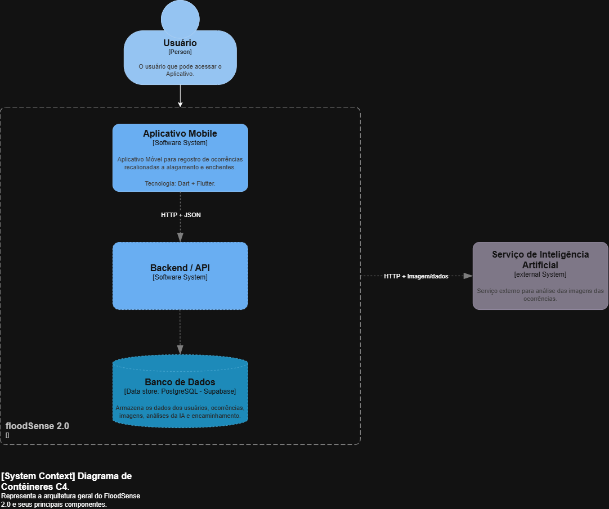

# Diagrama de contêineres modelo C4

diagrama responsável por mostrar a estrutura da arquitetura do FloodSense 2.0, nele é possivel ver todos os componentes, tecnologias e suas conexões.

## Componentes

### Usuário
Qualquer pessoa que tenha acesso ao aplicativo móvel pode acessar e se cadastrar, mas com restrição de idade(+18)

### Aplicativo Mobile
dentro do aplicativo é possivel usar a câmera para tirar foto de enchentes ou alagamentos e/ou possiveis situações de risco que podem acarretar esse tipo de problema. 
após tirar a foto um agente de IA vai decidir através de análise se encaminha a foto ou não para autoridades locais. A foto pode ser armazenada ou não dependendo da análise do agente.

### Backend & API
Responsável pelo processamento das requisições, aplicação das regras de negócio e os demais serviços seja interno ou externo.

## Banco de Dados
Responsável pelo armazenamento das informações do sistema como os dados do usuário, as fotos tiradas que passaram na análise do agente de IA, e as ocorrências registradas.

## Serviço de Inteligência Artificial
Serviço externo responsável pela análise do agente de IA. 
- [ ] decidir qual agente de IA vamos usar no projeto e atualizar o diagrama de contêineres(C4-model).

### Diagrama

